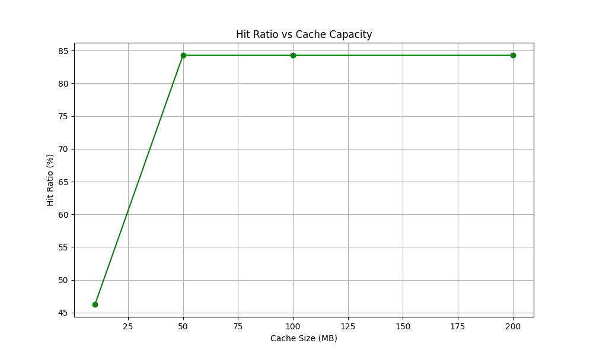
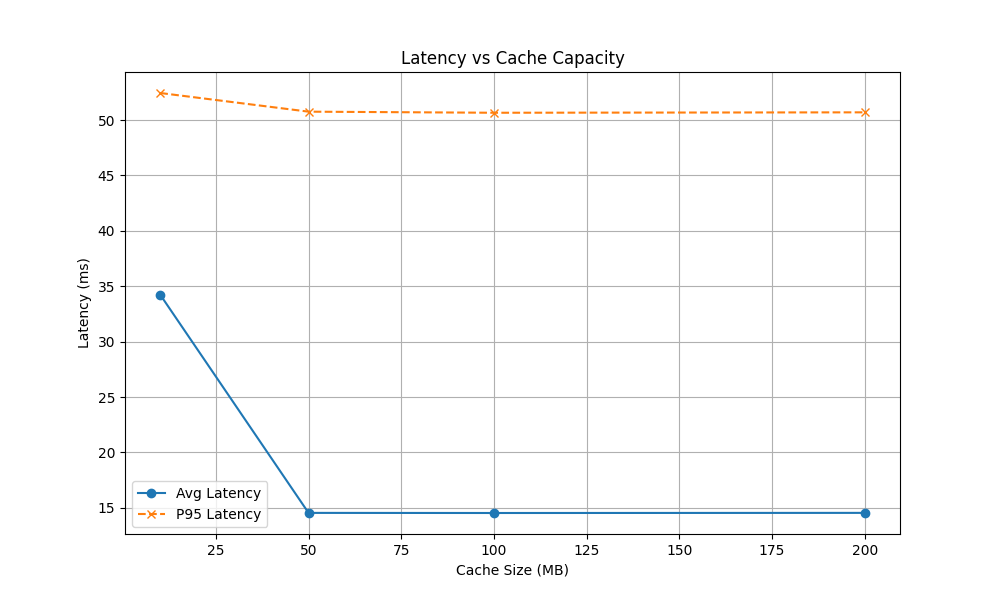

# Media Cache System Design 🚀

**Student:** Tran Phu Nghia (ID: 20233871)  
**Context:** Internship Project - Systems Engineering

## 📖 Overview
A high-performance user-space cache implementation for media streaming, simulating the interaction between a Video Client, Memory Cache, and Disk Origin.

## 🛠 Features implemented
- **Core:** LRU Cache with O(1) complexity.
- **Algorithms:** Comparison between **LRU** (Recency) vs **LFU** (Frequency).
- **Advanced:**
  - 🔄 **Two-Tier Cache:** Separating thumbnails (Small) and segments (Large).
  - 🚀 **Prefetching:** Zero-latency playback by predicting next segments.
  - 🔒 **Concurrency:** Thread-safe implementation handling 50+ clients.
  - 💾 **Persistence:** Crash-recovery using Disk-backed cache.

## 📊 Performance Results
The system reduces P95 Latency from **50ms** (Disk) to **<1ms** (Cache).

### 1. Hit Ratio


### 2. Latency Reduction


## 🚀 How to Run
1. **Generate Data:**
   ```bash
   python3 generate_data.py
